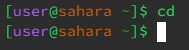

# Lab 1 Report  
1. no arguments
   1. cd
      * 
      * The working directory was /home
      * I got this output because there was no argument so the workings directory did not change
      * This is not an error
   2. ls
      * 
      * The working directory was /home
      * I got this output because the working directory was /home so ls only shows lecture1 as that is the only file on /home
      * This is not an error
   3. cat
      * 
      * The working directory was /home
      * I got this output because there is no argument so there is nothing for cat to show since there is no file that it can output
      * This is an error because cat looks to concatenate a file, but since there is nothing to concatenate it is just stuck on the terminal
2. directory as an argument
   1. cd
      * 
      * The working directory when the command was run was /home
      * I got this output because the argument was a directory which means that the working directory will change to whatever the argument is if it exists
      * This is not an error
   2. ls
      * 
      * The working directory when the command was run was /home/lecture1
      * I got this output because ls was trying to find lecture1 within lecture1 and that doesn't exist. However, if the working directory was /home, then it would work since lecture1 would exist within /home
      * This is an error since it indicates that lecture1 does not exist within the current working directory, which might reveal a deeper problem such as a file or directory that is misplaced or of a different name
   3. cat
      * 
      * The working directory when the command was run was /home
      * I got this output because cat concatenates files and since the argument is a directory, there are no contents to print
      * This is an error since cat only concatenates files and it helps indicate that something is wrong or the file is of a different name
3. file as an argument
   1. cd
      * 
      * The working directory is /home/lecture1
      * I got this output because cd looks to change working directories, but since the argument is a file there is nothing for it to change to
      * This is an error because cd is used to change working directories and if it indicates that it is not a directory, then the file is either misplaced or named
   2. ls
      * 
      * The working directory is .home/lecture1
      * I got this output because ls lists out the files and directories in the path, but since the file is not a directory and the output is only itself
      * This is not an error
   3. cat
      * 
      * The working directory is /home/lecture1
      * I got this output because cat looks to concatenate files and Hello.java is a file, so it prints out all its contents
      * This is not an error
