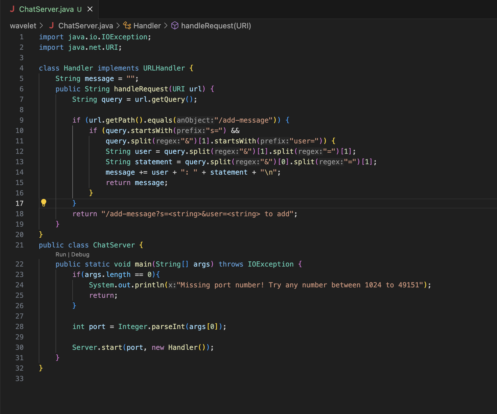
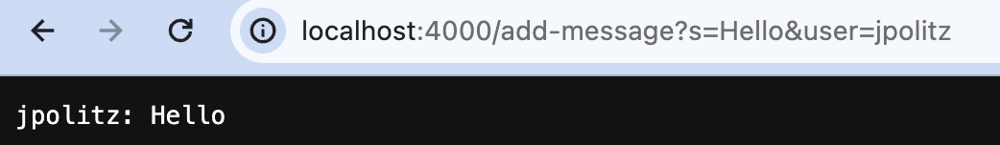
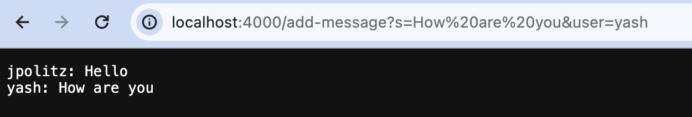
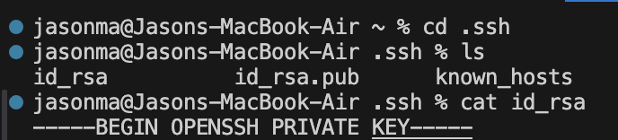
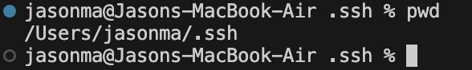
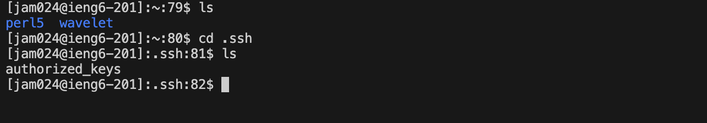
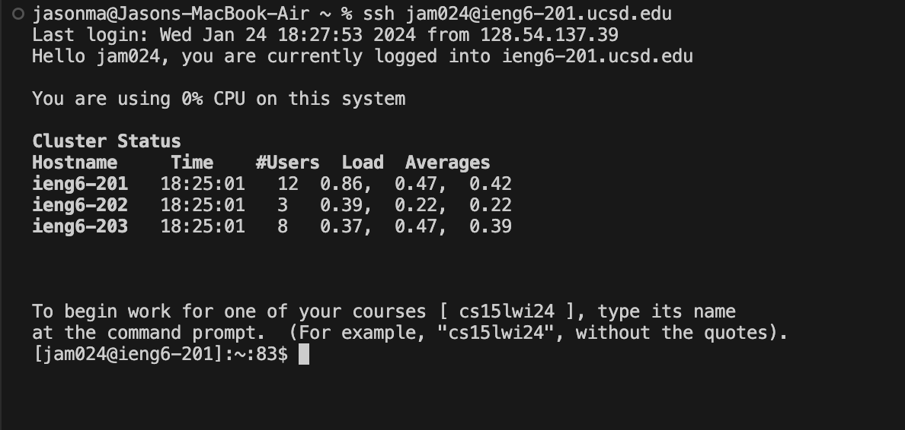

# Lab Report 2  
## Part 1
  ChatServer code  
    
  1. First add-message
     
     * ```
        # methods called in my code

          # handleRequest in Handler class
        class Handler implements URLHandler {
          public String handleRequest(URI url) {
            ...
          }
        }

          # main method in ChatServer class
          public class ChatServer {
            public static void main(String[] args) throws IOException {
              ...
            }
          }
        ```
     * ```
       # revelant arguments to these methods

        # url for handleRequest
        public String handleRequest(URI url) {
          ...
        }

        # port number for args for main method
        public static void main(String[] args) throws IOException {
          ...
        }
        
       # values of relevant fields:
       message = ""  
       query = ""  
       port = 4000  
       ```
       
     * ```
       # values that got changed from the request:
       message = "jpolitz: Hello\n"
       query = "s=Hello&user=jpolitz"
       ```
      
  2. Second add-message
     
     * ```
        # methods called in my code

          # handleRequest in Handler class
        class Handler implements URLHandler {
          public String handleRequest(URI url) {
            ...
          }
        }

          # main method in ChatServer class
          public class ChatServer {
            public static void main(String[] args) throws IOException {
              ...
            }
          }
        ```
     * ```
       # revelant arguments to these methods

        # url for handleRequest
        public String handleRequest(URI url) {
          ...
        }

        # port number for args for main method
        public static void main(String[] args) throws IOException {
          ...
        }
        
       # values of relevant fields:
       message = ""
       query = ""
       port = 4000
       ```
        
     * ```
       # values that got changed from the request:
       message = "jpolitz: Hello\n yash: How are you\n"
       query = "s=How are you&user=yash"
       ```
       

## Part 2
  1. private key  
       
       
     Absolute path is /Users/jasonma/.ssh/id_rsa
     
  2. public key
     
  3. interaction with ieng6 without password
    

## Part 3
I learned the idea of remote servers from lab in week 2/3. I never thought about how people would remotely access files meant to be kept securely. So this idea of the remote server, with specific people who can access what is within that server is interesting and opens up how people might program in the real world. 
