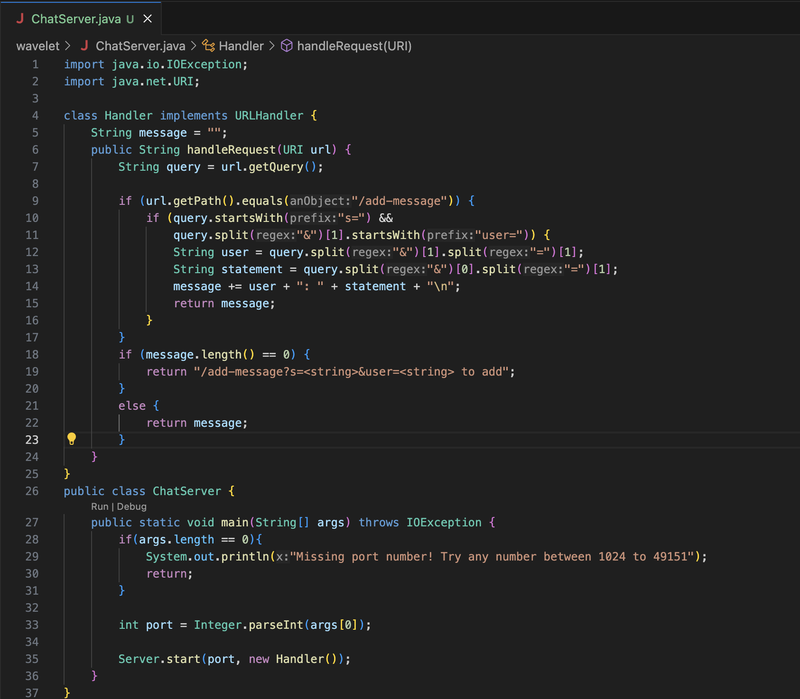

# Lab Report 2  
## Part 1
  ChatServer code  
    
  1. First add-message
     
     * The methods in my code that are called are the handleRequest method in the Handler class and the main method in the ChatServer class
     * The relevant arguments to these methods are the URL for the handleRequest method and the main method is the port number; values of relevant fields is "" for message,
       "" for query, and 4000 for port
     * values that got changed from the request is that message is now "jpolitz: Hello\n" and "/add-message?s=<string>&user=<string>" for query
  2. Second add-message
     
     * The methods in my code that are called are the handleRequest method in the Handler class and the main method in the ChatServer class
     * The relevant arguments to these methods are the URL for the handleRequest method and the main method is the port number; values of relevant fields is "" for message,
       "" for query, and 4000 for port
     * values that got changed from the request is that message is now "jpolitz: Hello\n" and "/add-message?s=<string>&user=<string>" for query
  
