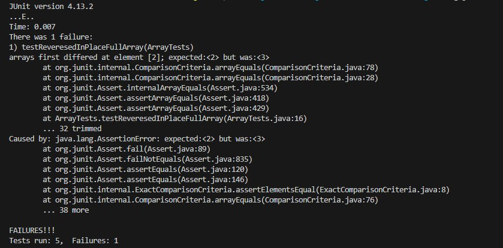

# Lab 3 Report  
## Part 1 - Bugs  
* ```
  # failure-inducing input
  @Test
  public void testReveresedInPlaceFullArray() {
    int[] input = {1, 2 ,3 ,4};
    ArrayExamples.reverseInPlace(input);
    assertArrayEquals(new int[]{4, 3, 2, 1}, input);
  }
  ```
* ```
  # input that does not induce failure
  @Test 
	public void testReverseInPlace() {
    int[] input1 = { 3 };
    ArrayExamples.reverseInPlace(input1);
    assertArrayEquals(new int[]{ 3 }, input1);
	}
  ```
*
  
* ```
  # before code-fix
  static void reverseInPlace(int[] arr) {
    for(int i = 0; i < arr.length; i += 1) {
      arr[i] = arr[arr.length - i - 1];
    }
  }
  ```
  ```
  # after code-fix
  static void reverseInPlace(int[] arr) {
    for(int i = 0; i < arr.length/2; i += 1) {
      int temp = arr[i];
      arr[i] = arr[arr.length - i - 1];
      arr[arr.length - i - 1] = temp;
    }
  }
  ```
  This fixes the code as it creates a temp variable that holds the value of the index where the array is being reversed.
  This allows the for loop to reverse rather than the array being mirrored. Using the temp variable and changing it
  in the same iteration means that the loop only lasts half of the array length.
## Part 2 - Researching Commands  
* __grep -An__ [Source](https://www.geeksforgeeks.org/grep-command-in-unixlinux/)
  ```
  $ grep -A1 "cell" technical/biomed/*.txt
     ...lines...
  	technical/biomed/rr73.txt:            cellophane sheets (Pharmacia Biotech, San Francisco,
		technical/biomed/rr73.txt-            CA, USA).
		--
		technical/biomed/rr74.txt:        the redox state of pulmonary artery endothelial cells in
		technical/biomed/rr74.txt-        culture suggested that activation of redox-sensitive
		--
		technical/biomed/rr74.txt:        expression in systemic and pulmonary endothelial cells from
		technical/biomed/rr74.txt-        different species in cultures [ 31, 32, 33, 34, 35, 36, 37]
  ```
  ```
  $ grep -A10 "cell" technical/plos/*.txt
     ...lines...
  	--
		technical/plos/pmed.0020273.txt:        three major groups: immune and inflammatory response; oncogenesis, cell proliferation, and
		technical/plos/pmed.0020273.txt-        growth; or structure and permeability. For immune and inflammatory response, the team
		technical/plos/pmed.0020273.txt-        identified many genes associated with aberrant immune response; it is not surprising,
		technical/plos/pmed.0020273.txt-        perhaps, to find a general up-regulation of immune response and antigen presentation in
		technical/plos/pmed.0020273.txt:        IBD. Several genes associated with cell growth and proliferation were up-regulated in UC—a
		technical/plos/pmed.0020273.txt-        finding similar to previous microarray studies that had reported involvement of
		technical/plos/pmed.0020273.txt-        cancer-related genes in IBD (although the altered genes were different). There was also an
		technical/plos/pmed.0020273.txt-        enrichment of genes associated with structure and permeability; in this class several genes
		technical/plos/pmed.0020273.txt-        were ubiquitously altered in both IBD and non-IBD samples, reflecting dysregulation of
		technical/plos/pmed.0020273.txt:        genes for paracellular permeability, degradation of extracellular matrix, and barrier
		technical/plos/pmed.0020273.txt-        protection against bacterial invasion of the epithelial surface.
		technical/plos/pmed.0020273.txt-        Ultimately this study highlights the complex pathogenesis of UC and CD, and indicates
		technical/plos/pmed.0020273.txt-        some possible future avenues for research of mucosal diseases in general. It demonstrates
		technical/plos/pmed.0020273.txt-        that genomic technologies are suitable to directly dissect human pathophysiology.
		technical/plos/pmed.0020273.txt-
		technical/plos/pmed.0020273.txt-
		technical/plos/pmed.0020273.txt-
  ```
  The option -A means it will print the line with the pattern and n lines after it. This might be useful if someone
  wants context of lines of the files they grep 
* __grep -n__ [Source](https://www.geeksforgeeks.org/grep-command-in-unixlinux/)
  ```
  $ grep -n "blood" technical/plos/*.txt
     ...lines...
  	technical/plos/pmed.0020242.txt:43:        + cells to be captured and separated from red blood cells, another
  	technical/plos/pmed.0020268.txt:11:        To assess disease severity, peripheral blood parasitemia is measured, but this is only a
  	technical/plos/pmed.0020268.txt:37:        severity and outcome. By contrast, peripheral blood parasitemia and the number of
  ```
  ```
  $ find technical/government/* | xargs grep -n "program"
     ...lines...
  	technical/government/Post_Rate_Comm/ReportToCongress2002WEB.txt:513:approved a two-year experiment of a program that enabled users of
  	technical/government/Post_Rate_Comm/ReportToCongress2002WEB.txt:518:ultimately approved a request to make the experimental program a
  	technical/government/Post_Rate_Comm/ReportToCongress2002WEB.txt:644:advertising and other program-related expenses. 
  ```
  The option -n means that the lines with the pattern are printed with their line numbers. This might be useful because
  you might want to know where the line of that file is located.
* __grep -i__ [Source](https://www.geeksforgeeks.org/grep-command-in-unixlinux/)
  ```
  $ grep -i "cell" technical/biomed/*.txt
     ...lines...
  	technical/biomed/rr73.txt:            Cell (BIO-RAD, Hercules, CA). The proteins were
  	technical/biomed/rr73.txt:            Cell (BIO-RAD, Hercules, CA, USA). The blots were
  	technical/biomed/rr74.txt:        the redox state of pulmonary artery endothelial cells in
  	technical/biomed/rr74.txt:        expression in systemic and pulmonary endothelial cells from
  ```
  ```
  $ grep "cell" technical/biomed/*.txt | wc
     20416  193374 1982872
  $ grep -i "cell" technical/biomed/*.txt | wc
     21300  200834 2064064
  ```
  The option -i is case insensitive so it will grep lines with the pattern without checking cases. This is useful to people who are only
  focused on finding lines with that specific pattern and not interested in whether there are different cases or not. 
* __grep -v__ [Source](https://www.geeksforgeeks.org/grep-command-in-unixlinux/)
  ```
  $ grep -v "cell" technical/biomed/*.txt
     ...lines...
  	technical/biomed/rr74.txt:        chain reaction; RIPA = radioimmunoprecipitation assay; RVsP
  	technical/biomed/rr74.txt:        = right ventricular systolic pressure.
  	technical/biomed/rr74.txt:
  	technical/biomed/rr74.txt:
  	technical/biomed/rr74.txt:
  ```
  ```
  $ wc technical/plos/*.txt
     ...lines...
  	53     570    4146 technical/plos/pmed.0020275.txt
     	41     372    2779 technical/plos/pmed.0020278.txt
     	40     387    2851 technical/plos/pmed.0020281.txt
     38081  408246 3032892 total
  $ grep "cell" technical/plos/*.txt | wc
     1717   23688  218292
  $ grep -v "cell" technical/plos/*.txt | wc
     36364  422639 4135119
  ```
  The option -v prints all the lines that are not the pattern. This is useful for people who are trying to filter out the pattern
  rather than searching for the pattern.

