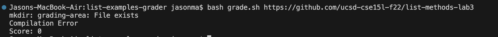
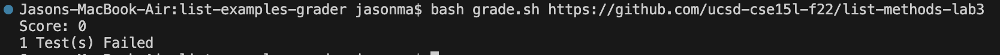

# Lab Report 5  
## Part 1  
1) Post From Student
  
>When using grade.sh on the repository of [https://github.com/ucsd-cse15l-f22/list-methods-lab3](https://github.com/ucsd-cse15l-f22/list-methods-lab3) it resulted in script finding ListExamples.java not to exist, despite the java file existing in the repository. 
>It seems that the new repository could not be created because there was one that already exists, which might mean the student-submission is from the last time I ran the grade script with another repository. 
2) TA Response
>Have you made sure that you implemented a way to delete the old repository in the script? If you have, go over the script and see if the removal is at the correct place in the script. 
3)

>The bug was that the removal was after making the new directory, so my script ran everything on the old directory rather than the new one 
4) Information About Setup
- The file was grade.sh and the directory structure consisted of ../list-examples-grade with TestListExamples, grade.sh, /grading-area, /student-submission, and /lib. /student-submission having everything from given repostiroy and /grading-area with everything from /grading-area copied and copy of TestListExamples and the lib directory
- ``` grade.sh
  CPATH='.:lib/hamcrest-core-1.3.jar:lib/junit-4.13.2.jar'

  mkdir grading-area

  git clone $1 student-submission 2> git-output.txt
  ... 
  rm -rf student-submission
  rm -rf grading-area
  ```
- f
- 
