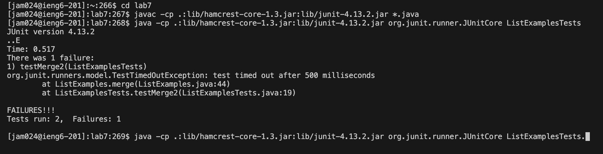

# Lab Report 4  
## Step 4: Log into ieng6  
  
Keys Pressed: `ssh jam024@ieng<Enter>` which is the commands that logs me into ieng6  
## Step 5: Clone your fork of the repository from your Github account (using the SSH URL)  
  
Keys Pressed: `git clone <ctrl-v><Enter>`, git clone is the command that clones the repository,  
              the ssh URL was `git@github.com:Kasojas/lab7.git` which I copied from Github
              and pasted it into the terminal  
## Step 6: Run the tests, demonstrating that they fail  
  
Keys Pressed: `cd lab7<Enter><ctrl-v><Enter><ctrl-v> L<Tab>T<Tab><Backspace><Enter>`, I changed the working directory to lab7
              I copied `javac -cp .:lib/hamcrest-core-1.3.jar:lib/junit-4.13.2.jar *.java` and pasted it into the terminal, 
              then copied and pasted `java -cp .:lib/hamcrest-core-1.3.jar:lib/junit-4.13.2.jar org.junit.runner.JUnitCore `
              and typed L and T with tab to autofill to ListExamplesTests. and backspace to delete the period so it becomes 
              `java -cp .:lib/hamcrest-core-1.3.jar:lib/junit-4.13.2.jar org.junit.runner.JUnitCore ListExamplesTests`  
## Step 7: Edit the code file to fix the failing test  
   
Keys Pressed: `vim L<Tab>T<Tab><Enter> <Esc>/l1<Enter> n<RIGHT>s2<DOWN><Backspace>1 <Esc>:x<Enter>`, type vim with L and T with tabs to autofill ListExamplesTests.java
              then you enter the file with vim. In normal mode, enter /l1 to search for l1 and n to go through all of l1 and to edit the file to correct the test s2 to switch `l1` to `l2`,
              and then go down to the line under and switch `l2` to `l1` and save and exit with `:x`
## Step 8: Run the tests, demonstrating that they now succeed  
  
Keys Pressed: `<UP><UP><UP><ENTER> <UP><UP><UP><ENTER>`, I used up arrow three times to get `javac -cp .:lib/hamcrest-core-1.3.jar:lib/junit-4.13.2.jar *.java` from the search history,
              and up arrow three times to get `java -cp .:lib/hamcrest-core-1.3.jar:lib/junit-4.13.2.jar org.junit.runner.JUnitCore ListExamplesTests` from the search history to run the tests
## Step 9: Commit and push the resulting change to your Github account  
  
Keys Pressed: `git add Li<Tab><ENTER> git commit -m "fixed tests"<Enter> git push origin main<Enter>` git add and autofill ListExamplesTests.java to add changes to commit,
              git commit -m "fixed tests" to commit changes with commit message, and git push origin main to push it to Github
